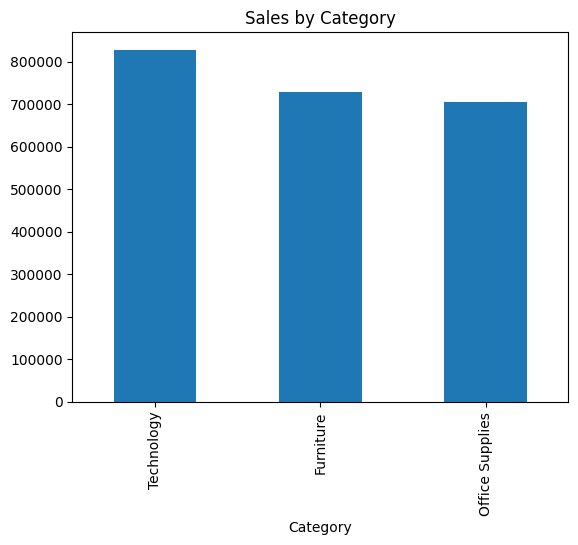
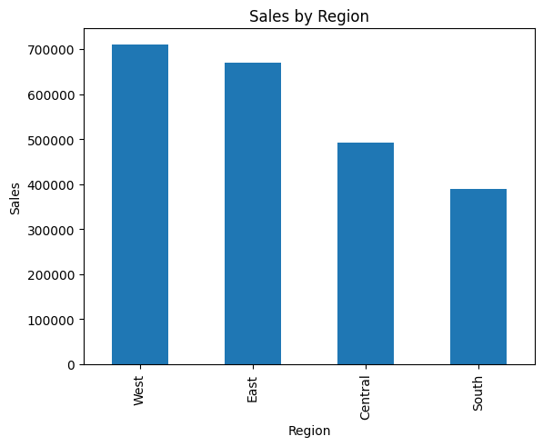
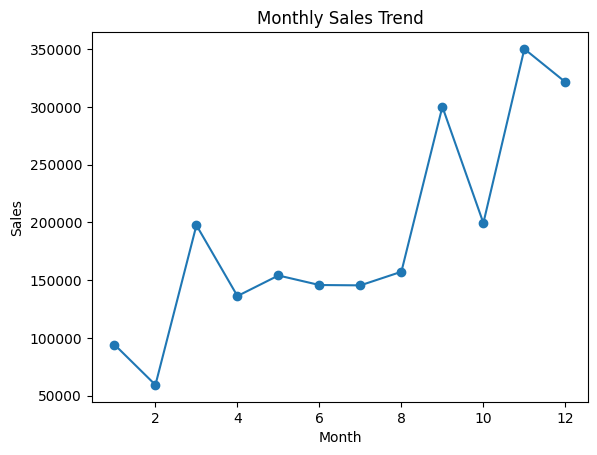
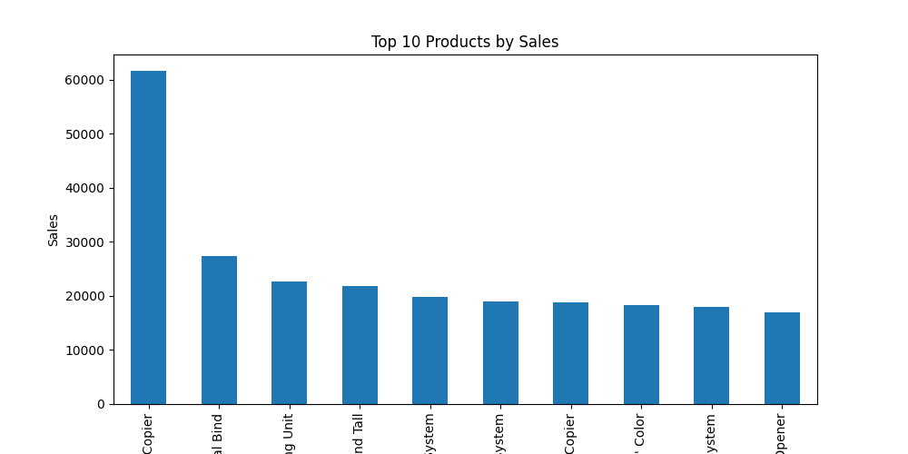
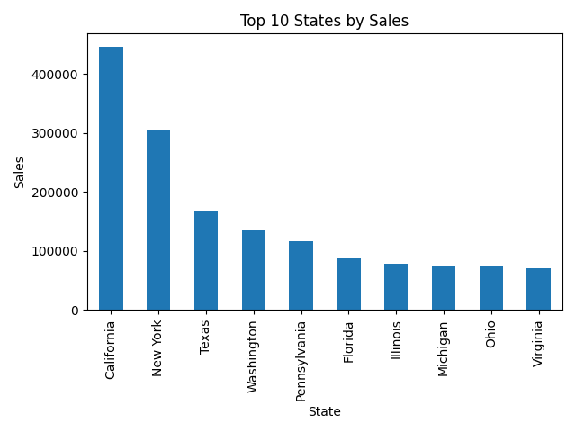

# Superstore Sales Analysis

## Project Overview

This project analyzes Superstore sales data using Python. The objective is to identify sales trends, top-performing categories, regions, products, and states to generate business insights.

---

## Dataset Description

The dataset contains information about:

- Orders
- Customers
- Products
- Regions
- States
- Sales

Main columns include:

- Order Date
- Ship Date
- Customer Name
- Category
- Sub-Category
- Region
- State
- Product Name
- Sales

---

## Tools Used

- Python
- Pandas
- NumPy
- Matplotlib
- Seaborn
- Jupyter Notebook
- GitHub

---

## Data Cleaning

- Checked missing values
- Filled missing Postal Codes
- Verified duplicate records

---

## Key Insights

### Sales by Category

- Technology generated the highest sales ($827,455.87)
- Furniture generated $728,658.58
- Office Supplies generated $705,422.33

### Sales by Region

- West region generated the highest sales ($710,219.68)
- South region generated the lowest sales ($389,151.46)

### Monthly Sales Trends

- November recorded the highest sales ($350,161.71)
- February recorded the lowest sales ($59,371.12)

### Top Product

- Canon imageCLASS 2200 Advanced Copier generated the highest sales ($61,599.82)

### Top State

- California generated the highest sales ($446,306.46)

---

## Project Structure

```text
sales-data-analysis-project/
│
├── dashboard/
├── data/
│   ├── train.csv
│   └── superstore_cleaned.csv
├── notebooks/
│   └── sales_analysis.ipynb
├── visuals/
├── README.md
├── requirements.txt
└── .gitignore


## Visualizations

### Sales by Category


### Sales by Region


### Monthly Sales Trend


### Top 10 Products


### Top 10 States


## Author

Prasansha Bairagi
